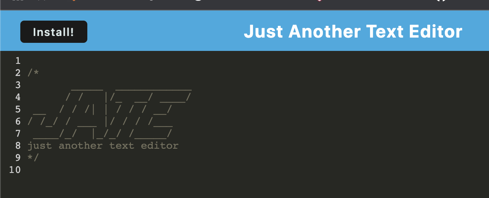
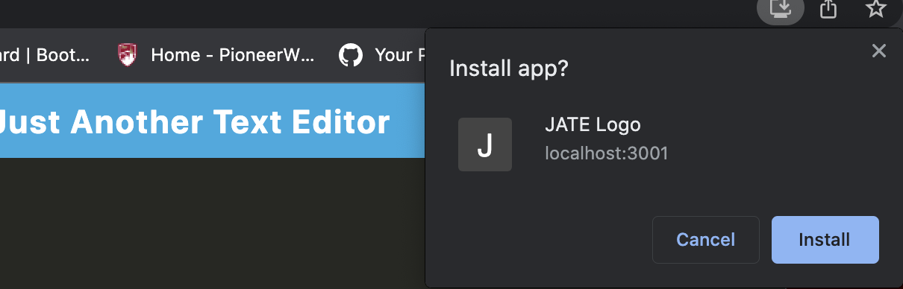

# Text-Editor

## Description
Welcome to J.A.T.E, or "just another text editor". JATE is a text editor that runs in the browser. This app is a single-page application that meets the PWA criteria. Additionally, it features a number of data persistence techniques that serve as redundancy in case one of the options is not supported by the browser.

## Installation
* Clone the repository using:
```
git clone https://github.com/carsonccu/Text-Editor
```
* Ensure you are in the current working directory
* Install dependencies by opening the terminal (ctrl + j on windows) and running:
```
npm install || npm i
```
* Run the project by typing the following in the terminal in order:
```
npm run build 
npm run start
```
## Screenshot





## Links

Heroku: https://text-editor-carson.herokuapp.com/

Github: https://github.com/carsonccu/Text-Editor

